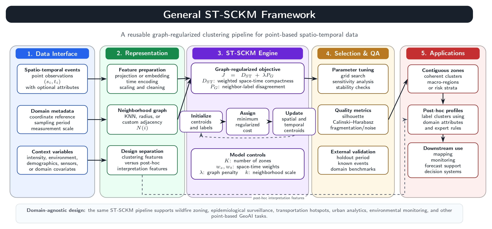

# ST-SCKM: Spatio-Temporal Spatially Constrained K-Means

<div align="center">


</div>

Official implementation of **Spatio-Temporal Spatially Constrained K-Means (ST-SCKM)**, a graph-constrained clustering algorithm for point-based spatio-temporal data.

ST-SCKM extends the conventional K-Means algorithm by jointly optimizing

- spatial similarity,
- temporal similarity,
- attribute similarity, and
- graph-based spatial contiguity,

thereby producing spatially coherent and temporally consistent clusters suitable for geospatial decision-making.

<p align="center">

</p>

---

# Related Publication

**Performance Evaluation of ST-DBSCAN and Spatio-Temporal Spatially Constrained K-Means (ST-SCKM) for Wildfire Risk Zoning and Resilience Analysis**

**Journal of Safety Science and Resilience (Scopus Q1)**

**Status:** Accepted for publication

**DOI:** *(https://doi.org/10.1016/j.jnlssr.2026.100357)*

---

# Features

- Graph-constrained K-Means
- Spatially contiguous clustering
- Temporal weighting
- Flexible neighborhood constraints
- Synthetic data generator
- Wildfire risk zoning
- GeoAI applications
- Fully reproducible workflow

---

# Applications

ST-SCKM can be applied to

- Wildfire Risk Mapping
- Environmental Monitoring
- Epidemiology
- Disaster Risk Analysis
- Transportation Analytics
- Remote Sensing
- Spatial Statistics
- GeoAI
- Smart Cities

---

# Repository Structure

```text
ST-SCKM/
│
├── README.md
├── LICENSE
├── CITATION.cff
├── requirements.txt
├── DESCRIPTION
│
├── src/
│   ├── __init__.py
│   ├── st_sckm.py
│   ├── clustering.py
│   ├── graph.py
│   ├── distance.py
│   └── utils.py
│
├── data/
│   ├── sample_data.csv
│   └── README.md
│
├── examples/
│   ├── run_example.py
│   └── output/
│
├── notebooks/
│   ├── Example_California.ipynb
│   └── Parameter_Tuning.ipynb
│
├── figures/
│   ├── workflow.png
│   └── architecture.png
│
├── docs/
│   └── algorithm.pdf
│
└── paper/
    ├── citation.bib
    └── accepted_manuscript.pdf
```

---

# Installation

Clone the repository

```bash
git clone https://github.com/muhakbaridris/ST-SCKM.git

cd ST-SCKM
```

Create a virtual environment

```bash
python -m venv .venv
```

Linux/macOS

```bash
source .venv/bin/activate
```

Windows

```bash
.venv\Scripts\activate
```

Install dependencies

```bash
pip install -r requirements.txt
```

---

# Quick Start

```python
import pandas as pd

from src import STSCKM
from src.clustering import assign_risk_labels
from src.utils import add_default_features, standardize_features

df = pd.read_csv("data/sample_data.csv")

df = add_default_features(df)

X_spatial, _ = standardize_features(df, ["x_proj", "y_proj"])
X_temporal, _ = standardize_features(df, ["time_days"])

model = STSCKM(
    n_clusters=4,
    spatial_weight=0.5,
    temporal_weight=1.5,
    lambda_spatial=1.0,
    n_neighbors=5,
    random_state=42,
)

df["cluster"] = model.fit_predict(X_spatial, X_temporal)

df["risk_zone"] = assign_risk_labels(df, "cluster", "log_frp")
```

Run the complete example

```bash
python examples/run_example.py
```

---

# Mathematical Formulation

ST-SCKM minimizes

$$
J =
\sum_{i=1}^{n}
\left(
w_s
\|p_i-\mu_k^{(p)}\|^2
+
w_t
\|z_i-\mu_k^{(z)}\|^2
\right)
+
\lambda
\sum_{i=1}^{n}
\sum_{j\in N(i)}
\mathbf{1}(c_i\neq c_j)
$$

where

- $w_s$ : spatial weight
- $w_t$ : temporal weight
- $\lambda$ : graph penalty
- $N(i)$ : spatial K-nearest-neighbor graph

The first component minimizes spatial-temporal within-cluster variance, whereas the second component encourages geographically contiguous clusters.

---

# Data

The repository contains a synthetic dataset for demonstration purposes.

The experiments reported in the associated publication utilize

- NASA FIRMS active fire observations
- ERA5 reanalysis meteorological variables

covering California, USA (2019–2024).

---

# Authors

| Author | Affiliation | Scopus |
|---------|-------------|---------|
| Muh. Akbar Idris | School of Data Science, Mathematics and Informatics, IPB University | https://www.scopus.com/authid/detail.uri?authorId=60611693800 |
| Muhammad Nur Aidi | School of Data Science, Mathematics and Informatics, IPB University | https://www.scopus.com/authid/detail.uri?authorId=55243253200 |
| Anik Djuraidah | School of Data Science, Mathematics and Informatics, IPB University | https://www.scopus.com/authid/detail.uri?authorId=56716188100 |

---

# Citation

If ST-SCKM contributes to your research, please cite both the software repository and the associated publication.

```bibtex
@article{Idris2026,
  title={Performance Evaluation of ST-DBSCAN and Spatio-Temporal Spatially Constrained K-Means (ST-SCKM) for Wildfire Risk Zoning and Resilience Analysis},
  author={Idris, Muh. Akbar and Aidi, Muhammad Nur and Djuraidah, Anik},
  journal={Journal of Safety Science and Resilience},
  year={2026},
  note={Accepted},
  doi={To be updated}
}
```

Software citation is also available in

```
CITATION.cff
```

---

# Acknowledgments

This repository was developed as part of graduate research conducted at the **School of Data Science, Mathematics and Informatics (SSMI), IPB University**.

The authors sincerely thank **Prof. Dr. Muhammad Nur Aidi, M.S.** and **Prof. Dr. Anik Djuraidah, M.S.** for their invaluable supervision, scientific guidance, and constructive discussions throughout the development of the ST-SCKM methodology.

This research was financially supported by the **Indonesia Endowment Fund for Education (LPDP), Ministry of Finance of the Republic of Indonesia**.

The authors also acknowledge

- NASA Fire Information for Resource Management System (FIRMS)
- Copernicus Climate Change Service (ERA5)

for providing open-access datasets used in this study.

---

# License

This project is released under the MIT License.

---

# Future Development

The long-term roadmap includes

- Adaptive ST-SCKM
- Graph ST-SCKM
- Deep ST-SCKM
- GPU acceleration
- PyPI package
- R package
- KNIME integration
- QGIS plugin

---

## Contact

Muh. Akbar Idris

School of Data Science, Mathematics and Informatics (SSMI)

IPB University

📧 muhakbaridris@apps.ipb.ac.id

🌐 https://github.com/muhakbaridris
